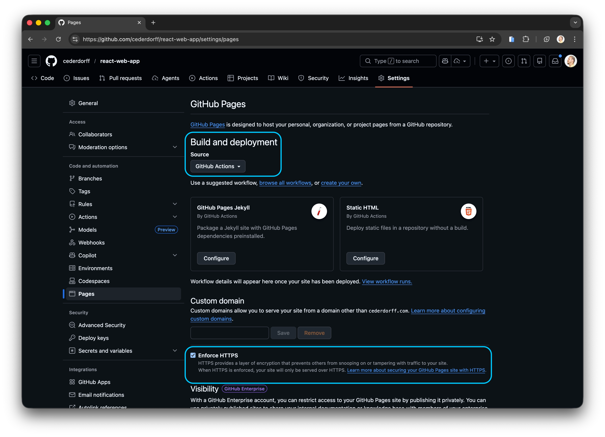
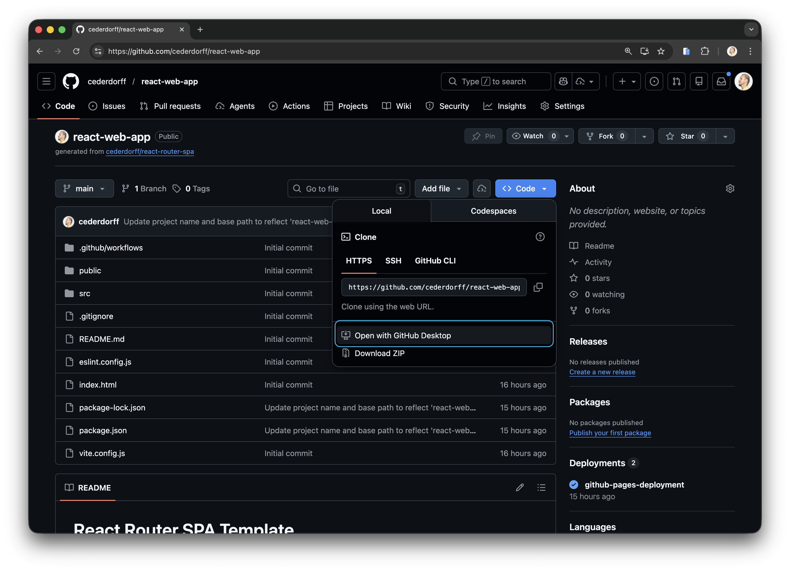
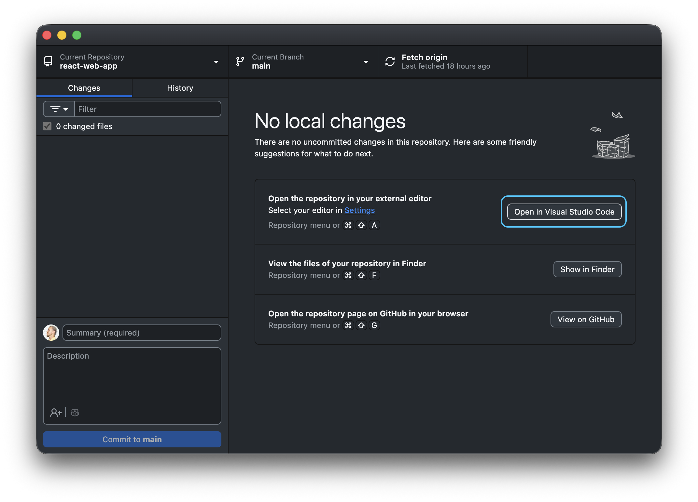
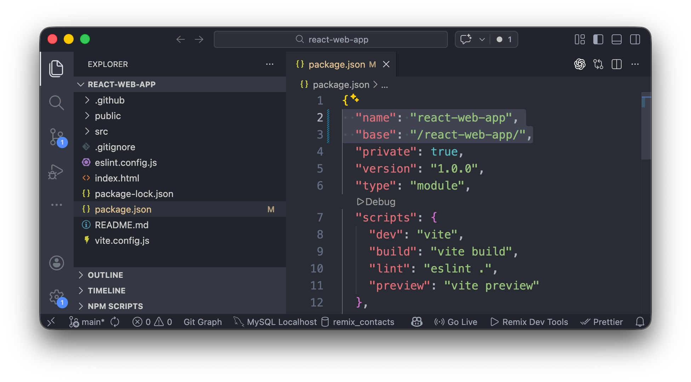
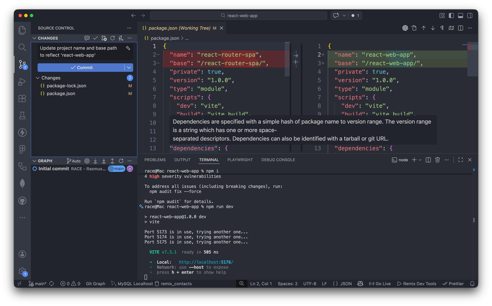
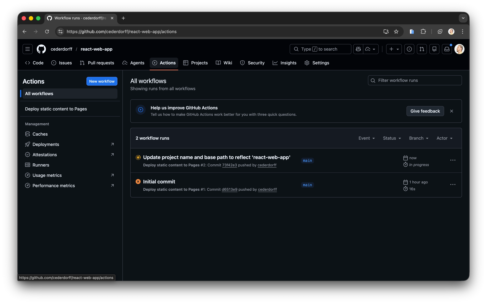
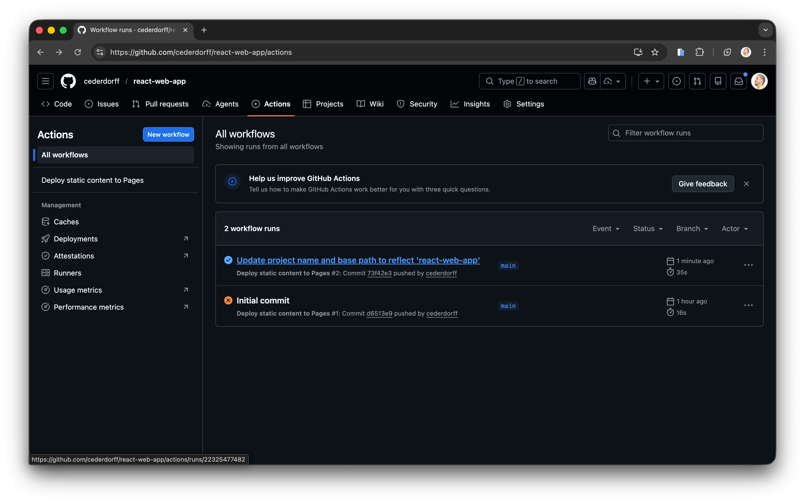
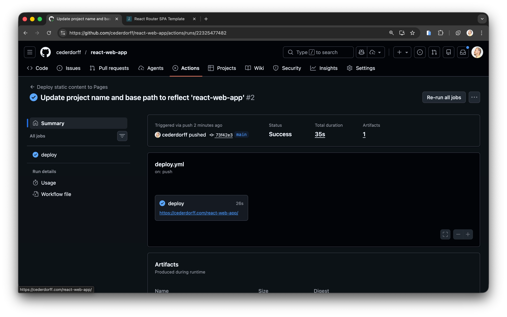
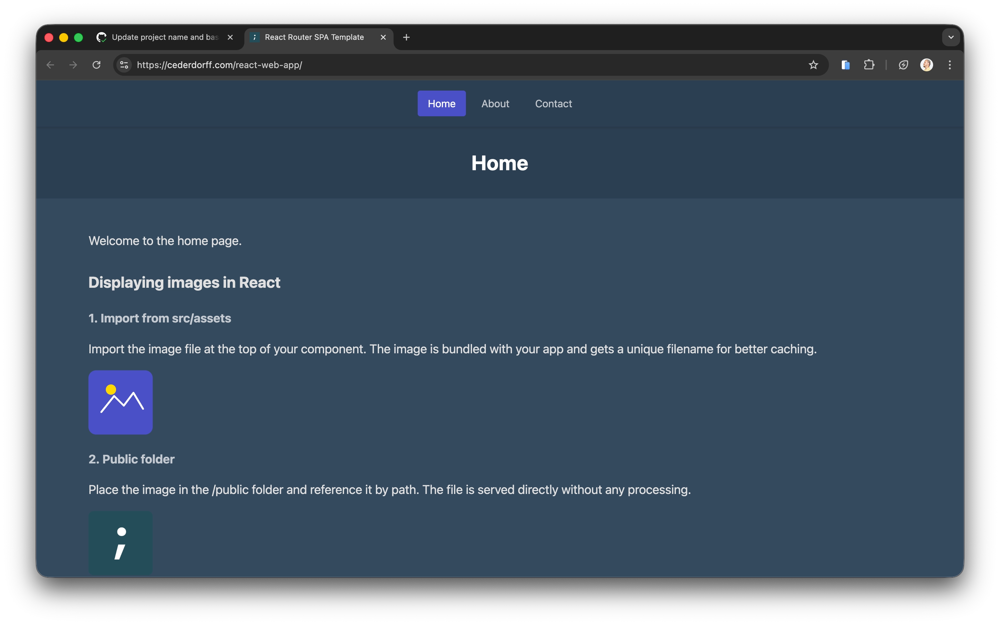

# Fra Template til GitHub Pages: Opsætningsguide

Del 1 af onboarding-guiden: opret jeres eget repository fra denne template, kør projektet lokalt, og deploy til GitHub Pages.  
Del 2 fortsætter i [collaboration-guide.md](collaboration-guide.md), hvor I arbejder med branches, Pull Requests og teamets samarbejdsflow.

## 1. Brug templaten

1. Åbn template-repository: https://github.com/cederdorff/react-router-spa
2. Klik **Use this template** -> **Create a new repository**.
3. Indtast et repository-navn (fx `react-router-app`, `customer-experience-exam`).
4. Sæt synlighed til **Public** (anbefalet ift. GitHub Pages og RACE-adgang).
5. Klik **Create repository**.

## 2. Aktivér GitHub Pages

1. Gå til jeres nye repository og vælg **Settings**.
2. Klik **Pages** i venstremenuen.
3. Under **Build and deployment**: sæt **Source** til **GitHub Actions**.
4. Aktivér **Enforce HTTPS**.



## 3. Clone repository

1. Gå til repository-forsiden (fanen **Code**).
2. Klik **Code** -> **Open with GitHub Desktop**.
   
3. Vælg, hvor projektet skal gemmes lokalt.
4. Efter clone: klik **Open in Visual Studio Code**.
   

## 4. Kør projektet lokalt

I projektmappen i VS Code, kør:

```bash
npm install
npm run dev
```

Åbn derefter den lokale URL fra terminalen og verificér, at appen virker i browseren.

## 5. Konfigurer base path

1. Åbn `package.json`.
2. Find feltet `base`.
3. Sæt det til jeres repository-navn med både foranstillet og efterstillet slash:

```json
"base": "/my-repo-name/"
```

Eksempel: Hvis repository hedder `react-web-app`, brug:

```json
"base": "/react-web-app/"
```

4. Valgfrit: Opdatér også `"name"`, så det matcher projektets navn (uden slashes).



## 6. Commit og push

Foretrukket (VS Code Source Control):

1. Åbn Source Control (`Ctrl+Shift+G` på Windows/Linux, `Cmd+Shift+G` på macOS).
2. Gennemgå ændrede filer.
3. Skriv en commit-besked.
4. Klik **Commit**.
5. Klik **Sync Changes** (push til GitHub).

Reference (GitHub Desktop):

1. Skriv en commit-besked i GitHub Desktop.
2. Klik **Commit to main**.
3. Klik **Sync Changes** (push til GitHub).



## 7. Verificér deployment

1. Åbn fanen **Actions** på GitHub.
   
2. Vent til deploy-workflow er gennemført uden fejl.
3. Åbn den afsluttede workflow-kørsel.
   
4. Klik på deployment-URL'en og test siden i browseren.
     
   

Deployment gennemført.

## 8. Test deployment med en lille ændring

Dette trin bekræfter, at jeres GitHub Pages-deployment opdateres efter et nyt push.

### 8.1 Lav en lille ændring

Åbn `src/pages/HomePage.jsx` og opdatér en synlig tekststreng. For eksempel:

```jsx
<p>Welcome to the home page.</p>
```

til:

```jsx
<p>Welcome to my first React app on GitHub Pages.</p>
```

### 8.2 Commit og push ændringen

Foretrukket (VS Code Source Control):

1. Åbn Source Control (`Ctrl+Shift+G` på Windows/Linux, `Cmd+Shift+G` på macOS).
2. Bekræft filændringen.
3. Tilføj commit-besked: `"Update homepage text"`.
4. Klik **Commit**.
5. Klik **Sync Changes**.

Reference (GitHub Desktop):

1. Åbn GitHub Desktop.
2. Bekræft ændringen i `src/pages/HomePage.jsx`.
3. Tilføj commit-besked: `"Update homepage text"`.
4. Klik **Commit to main**.
5. Klik **Push origin** (eller **Sync Changes**).

### 8.3 Følg deployment

1. Åbn jeres repository på GitHub.
2. Gå til fanen **Actions**.
3. Vent til deployment-workflow kører færdigt med grønt/blåt flueben.
   
4. Åbn jeres live-site URL og opdatér siden.
5. Bekræft, at tekstændringen er synlig online.

Tip: Deployment tager normalt 1-3 minutter efter push.

---

## Næste skridt

I har nu gennemført del 1: oprettelse fra template, lokal opsætning og deployment til GitHub Pages.

Fortsæt med del 2 i [collaboration-guide.md](collaboration-guide.md), hvor I arbejder med:

- collaborators
- branches
- Pull Requests
- sikker merge til `main`
